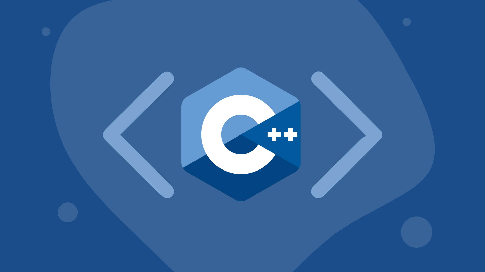

<h1 align="left"><strong>

SofyO

<h1 align="center"><strong> ¡Welcome to the repository of Sofia! </strong></h1>

## 
**C++ Programming course**

 

  

###  **Main structure** 

 Here you will find all the folders that take during the course , as well as the exercices for each unit. 

><a href="https://github.com/UP210419/UP210419_CPP/blob/main/U1/Readme.md">Unidad 1</a>
 

><a href="https://github.com/UP210419/UP210419_CPP/blob/main/U2/Readme.md">Unidad 2</a>
  

><a href="https://github.com/UP210419/UP210419_CPP/blob/main/U3/Readme.md">Unidad 3</a>

