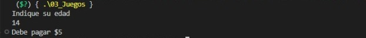

# **Unit 2**

### **Exercise 1: Write a program that asks the user for their annual income and shows the corresponding tax on the screen.**

***C++***
```c++
//Library for handling screen inputs and outputs 
#include <iostream>

//Using the namespace to avoid the std::
using namespace std; 

//Integer main function 
int main(){
```

***Input***
```c++ 
    //Declaration of variables
    int renta; 
    float impuesto;

    //Request payment for annual rent
    cout << "Indique aqui la cantidad de renta anual: ";
    cin >> renta;
```

***Process***
```c++
    cout << "Pago renta anual: $" << renta << "\n";

    //Use of income if less than $10,000
    if(renta < 10000){
        cout << "\nTu impuesto es de 5%"; //Tax of 5%
        impuesto = renta * .05; with tax of 5%
    }
    //Use of income if between $10,000 and $20,000
    if((renta >= 10000) && (renta <= 20000)){
        cout << "\nTu impuesto es de 15%"; //Tax of 15%
        impuesto = renta * .15; 
    }
    //Use of income if between $20,000 and $35,000
    if((renta >= 20000) && (renta <= 35000)){
        cout << "\nTu impuesto es de 20%"; //Tax of 20%
        impuesto = renta * .20; 
    }
    //Use of income if between $35,000 and $60,000
    if((renta >= 35000) && (renta <= 60000)){
        cout << "\nTu impuesto es de 30%"; //Tax of 30%
        impuesto = renta * .30; 
    }
    //Use of income if greater than $60,000
    if(renta > 60000){
        cout << "\nTu impuesto es de 45%"; //Tax of 60%
        impuesto = renta * .45; 
    }
```

***Output***
```c++
//Print total payment with tax to pay 
cout << "\nEl pago total es de: $" << impuesto;
cout << endl;
//Being a function, it must return a value, in this case 0
return 0;  
}
```
***Explanation***

This program calculates the total payment with annual income tax corresponding to its respective tax applied to each user.

***Screenshots***

Renta de 5%

Renta de 15%

Renta de 20%

Renta de 30%

Renta de 45%


### **Exercise 2: Write a program that reads the user's score and indicates their level of performance, as well as the amount of money the user will receive.**

***C++***
```c++
//Library for handling screen inputs and outputs 
#include <iostream>

//Using the namespace to avoid the std::
using namespace std; 

//Integer main function 
int main(){
```

***Input***
```c++
    //Declaration of variables
    float puntuacion; 
    float inaceptable = 0.0;
    float aceptable = 0.4;
    float meritorio = 0.6;
    float ganancia; 

    //Request employee score
    cout << "Su puntuacion es: \n";
    cin >> puntuacion;
```

***Process and Output***
```c++
    //Use if 
    if(puntuacion == inaceptable){
        cout << "Tu nivel de rendimiento es inaceptable \n";
        ganancia = inaceptable * 2400;
        cout << "Tu ganancia es de: \n$" << ganancia; //OUTPUT
    }
    else if(puntuacion == aceptable){
        cout << "Tu nivel de rendimiento es aceptable \n"; 
        ganancia = aceptable * 2400;
        cout << "Tu ganancia es de: \n$" << ganancia; //OUTPUT
    }
    else if(puntuacion >= meritorio){
        cout << "Tu nivel de rendimiento es meritorio \n";
        ganancia = meritorio * 2400;
        cout << "Tu ganancia es de: \n$" << ganancia; //OUTPUT
    }
    else{
        cout << "Tu nivel de rendimiento es insuficiente \n"; //OUTPUT
        cout << "No hay ninguna ganancia"; //OUTPUT
    }
    cout << endl;
    //Being a function, it must return a value, in this case 0
    return 0;
}
```

***Explanation*** 

This program indicates the level of performance of each employee in a company, and the amount of money they will receive.

***Screenshots*** 

Puntuación de empleado de 0

Puntuación de empleado de 0.2

Puntuación de empleado de 0.4

Puntuación de empleado de 0.6

Puntuación de empleado de 2.8


### **Exercise 3: Write a program for a company that has game rooms for all ages and wants to automatically calculate the price to charge its customers to enter.**

***C++***
```c++
//Library for handling screen inputs and outputs 
#include <iostream>

//Using the namespace to avoid the std::
using namespace std; 

//Integer main function 
int main(){
```

***Input***
```c++
    //Declaration of variables
    int edad;

    //Request your age
    cout << "Indique su edad \n";
    cin >> edad;
```

***Process and Output***
```c++
    //Use if 
    if(edad < 4){
        cout << "Su entrada es gratis"; //OUTPUT
    }
    else if((edad >= 4) && (edad <= 18)){
        cout << "Debe pagar $5"; //OUTPUT
    }
    else if(edad > 18){
        cout << "Debe pagar $10"; //OUTPUT
    }
    cout << endl; 
    //Being a function, it must return a value, in this case 0
    return 0;
}
```

**Explanation** 

This program indicates the ticket price to be paid by ages.


***Screenshots*** 

Edad menor a 4 años 

Edad entre 4 años y 18 años  

Edad entre 4 años y 18 años 

Edad mayor a 18 años 


### **Exercise 4: Write a program that asks the user if he wants vegetarian pizza or not, and based on his answer shows him the menu with the ingredients available for him to choose from. You can only choose one ingredient besides the mozzarella and tomato that are on all the pizzas.**

***C++***
```c++ 
//Library for handling screen inputs and outputs 
#include <iostream>

//Using the namespace to avoid the std::
using namespace std; 

//Integer main function 
int mainI(){
``` 

***Input***
```c++
    //Declaration of variables
    int pizza;
    int ingrediente;

    //Request pizza of your choice
    cout << "     BELLA NAPOLI \n";
    cout << "1. Vegetariana \n";
    cout << "2. No vegetariana \n";
    cout << "\nIndique la pizza que desea ordenar \n";
    cin >> pizza;
```

***Process and Output***
```c++
    if(pizza == 1){
        cout << "\n     MENU VEGETARIANO \n"; 
        cout << "1. Pimiento \n";
        cout << "2. Tofu \n";

        cout << "\nIngredientes extra: \n";
        cin >> ingrediente; 
        if(ingrediente == 1){
            cout << "\n     PEDIDO \n"; 
            cout << "Pizza: \n" << "  Pizza vegetariana \n";
            cout << "Ingredientes: \n" << "  Mozzarella y tomate \n";
            cout << "Ingrediente extra: \n";
            cout << "  Pimiento";
        }
        else if(ingrediente == 2){
            cout << "\n     PEDIDO \n"; 
            cout << "Pizza: \n" << "  Pizza vegetariana \n";
            cout << "Ingredientes: \n" << "  Mozzarella y tomate \n";
            cout << "Ingrediente extra: \n";
            cout << "  Tofu";
        }
    }else if(pizza == 2){
        cout << "\n     MENU NO VEGETARIANO \n";
        cout << "1. Peperoni \n";
        cout << "2. Jamon \n";
        cout << "3. Salmon \n";

        cout << "\nIngredientes extra: \n";
        cin >> ingrediente; 

        if(ingrediente == 1){
            cout << "\n     PEDIDO \n"; 
            cout << "Pizza: \n" << "  Pizza no vegetariana \n";
            cout << "Ingredientes: \n" << "  Mozzarella y tomate \n";
            cout << "Ingrediente extra: \n";
            cout << "  Peperoni";
        }
        else if(ingrediente == 2){
            cout << "\n     PEDIDO \n"; 
            cout << "Pizza: \n" << "  Pizza no vegetariana \n";
            cout << "Ingredientes: \n" << "  Mozzarella y tomate \n";
            cout << "Ingrediente extra: \n";
            cout << "  Jamon";
        }
        else if(ingrediente == 3){
            cout << "\n     PEDIDO \n"; 
            cout << "Pizza: \n" << "  Pizza no vegetariana \n";
            cout << "Ingredientes: \n" << "  Mozzarella y tomate \n";
            cout << "Ingrediente extra: \n";
            cout << "  Salmon";
        }
    }
    cout << endl;
    //Being a function, it must return a value, in this case 0
    return 0;
}
```

**Explanation** 

This program shows the order information per user in pizzeria Bella Napoli.

***Screenshots***

Pizza Vegetariana

Pizza No Vegetariana


### **Exercise 5: Make a program in which 6 temperatures are entered and determine the average, the lowest and the highest.**

***C++***
```c++
//Library for handling screen inputs and outputs 
#include <iostream>

//Using the namespace to avoid the std::
using namespace std; 

//Integer main function 
int mainI(){
```

***Input and Process***
```c++
    //Declaration of variables
    int contador;
    float temperatura;
    float AcumTemp=0;
    float promedio; 
    float baja = -30, alta = 40;

    do{
        //Request the temperature 
        cout << "Dame la temperatura: ";
        cin >> temperatura;

        AcumTemp += temperatura;
        promedio = AcumTemp / 6;

        if(temperatura > alta){
            alta = temperatura;
        }
        if(temperatura < alta){
            baja = temperatura;
        }

        contador ++;
    }while(contador <= 6);
```

***Output***
```c++
    cout << "\nEl promedio de temperatura es: " << promedio;
    cout << "\nLa temperatura minima es de: " << baja;
    cout << "\nLa temperatura maxima es de: " << alta;
    cout << endl; 
    //Being a function, it must return a value, in this case 0
    return 0;
}
```

***Explanation***


This program calculates the average temperature of 6 different users and indicates the minimum and maximum temperatures of the data that was entered.

***Screenshots***

Temperatura promedio, minima y maxima 


### **Exercise 6: Make a program that reads indefinitely quantities of products and their price, and at the end indicates the total of the invoice. To know that the purchase has been completed, a 0 must be entered in the quantity.**

***C++***
```c++
//Library for handling screen inputs and outputs 
#include <iostream>

//Using the namespace to avoid the std::
using namespace std; 

//Integer main function 
int mainI(){ 
```

***Input and Process***
```c++
    //Declaration of variables 
    int cant; 
    int precio;

    do{  
        //Request quantity of products you buy
        cout << "Cantidad de productos que desea comprar: ";
        cin >> cant; 

        if(cant != 0){
        //Request product price 
        cout << "Precio de producto a comprar: ";
        cin >> precio;
        
        total = total + precio * cant;   
        }
    }while(cant != 0);
```

***Output***
```c++
    cout << "\nFACTURA \n"; 
    cout << "---------------- \n";
    cout << "Pago total: $" << total;
    cout << endl;
    //Being a function, it must return a value, in this case 0
    return 0;
}
```

***Explanation***

This program registers a number of products purchased and the price of each of these of a user, and shows the total payment of the purchase.

***Screenshots***

Factura de pago total de una compra de varios productos


### **Exercise 7: Write a program that performs the conversion from binary to decimal, only for integers greater than 0. The result can be displayed as an integer variable or in a set of characters.**

***C++***
```c++ 
//Library for handling screen inputs and outputs 
#include <iostream>

//Using the namespace to avoid the std::
using namespace std; 

//Integer main function 
int mainI(){
``` 

***Input***
```c++
    //Declaration of variables
    int num; 
    string bin = ""; 
    
    //Request a number 
    cout << "Introduce un numero cualquiera ";
    cin >> num;
```

***Process***
```c++
    while(num != 0){
        if(num%2 == 0){
            bin = "0" + bin;
        }else{
            bin = "1" + bin; 
        }
        num = num/2;  
    }
```

***Output***
```c++
    cout << "Numero binario: " << bin;
    cout << endl; 
    //Being a function, it must return a value, in this case 0
    return 0; 
}
```

***Explanation***

This program converts any decimal number of type integer to binary number. 

***Screenshots***


**Exercise 8: Write a program that displays the multiplication table of a number entered by the user.**

***C++***
```c++ 
//Library for handling screen inputs and outputs 
#include <iostream>

//Using the namespace to avoid the std::
using namespace std; 

//Integer main function 
int mainI(){
``` 

***Input***
```c++ 
    //Declaration of variables
    int n;
    int x = 1; 
    int res;

    //Requests the number of the multiplication table to be displayed
    cout << "Introduce el numero de la tabla que deseas ver ";
    cin >> n;
```

***Process and Output***
```c++
    do{
        res = n*x;

        cout << "|  " << x << "     x     " << n << "     =     " << res << "   |" << "\n";
        cout << "---------------------------------- \n";
        x++;
    }while(x <= 10);

    cout << endl;
    //Being a function, it must return a value, in this case 0 
    return 0;
}
```

***Explanation***

This program shows the multiplication table of any integer type number that is entered by the user.

***Screenshots***


**Exercise 9: Write a program that obtains the root of a predetermined equation, using the bisection method.**

***C++***


***Input***


***Process***


***Output***


***Explanation***


***Screenshots***

