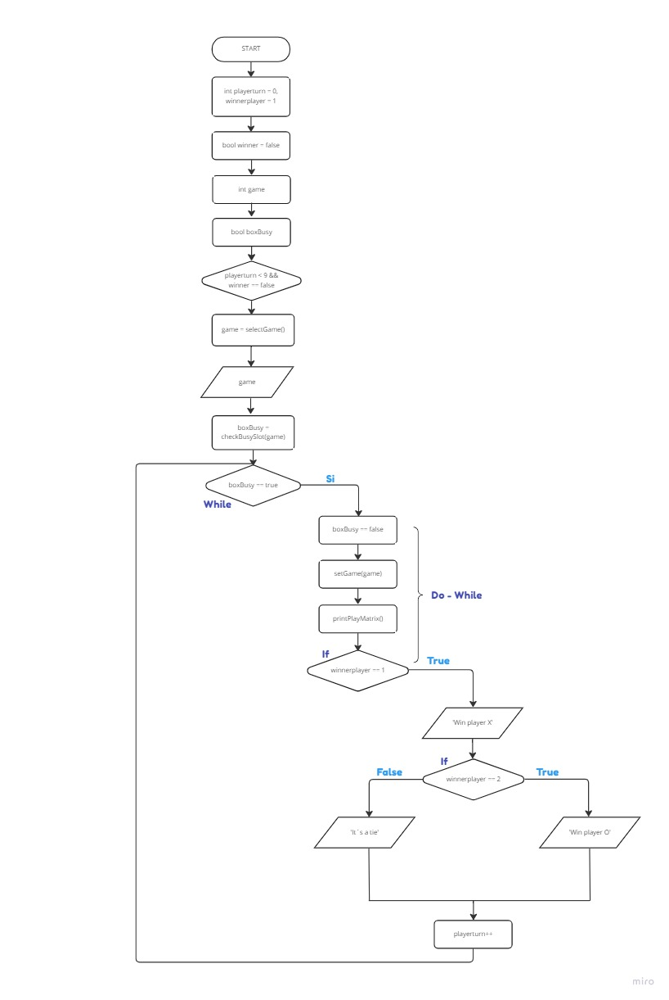

# 
 **CAT´S GAME**

## **Flowchart**

## Explanation 
Here is the Flow Chart, which represents our "Gat Game" program, based on the Main Function.

Shows the declaration of our variables used in the main function, both those that were declared as global, as well as those that belong to the main function, also, the functions that were created to run our game code, which will bring the data from input that are entered when starting the execution and that are requested by the PC, in addition to other ++ tools learned during the course, such as loops, in this case, While and Do While, and the if, else, and conditionals , at the end, the output data that was expected to be obtained at the end of the execution.

## 
 ***Screens***

 

