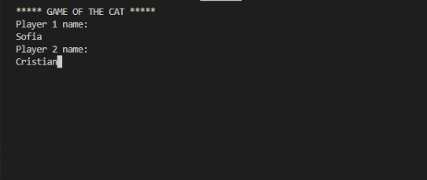
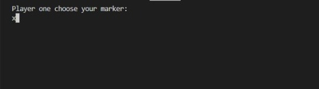
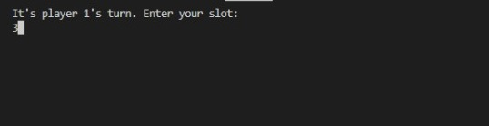
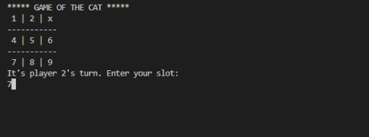
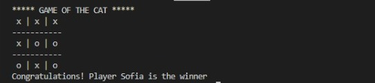

# <div align="center"> **CAT´S GAME**

## <div align="center"> ***Developing of program***

## ***Process***

```c++
#include <iostream>

using namespace std;

char board [3][3] = {{'1','2','3'},
                     {'4','5','6'},
                     {'7','8','9'}};

void createBoard(); //Crea tablero de juego
bool setMarker(int slot); //Coloca jugada en el tablero
char current_marker; //Marca de la jugada
int player; //Indica el jugador 
string player1; //Primer jugador 
string player2; //Segundo jugador 
int winner(); //Indica el ganador
void game(); //Es la jugada de la partida 
void swap_player_and_marker(); //Intercambia jugador y marcador 

int main (){

    system("cls");
    cout << "***** GAME OF THE CAT ***** \n";

    cout<<"Player 1 name:\n";
    cin>>player1;

    cout<<"Player 2 name:\n";
    cin >> player2;
    createBoard();
    system("cls");
    game();
    
    return 0;
}

void createBoard(){
    cout <<" "<<board[0][0]<<" | "<<board[0][1]<<" | "<< board[0][2]<<endl;
    cout << "-----------\n";
    cout <<" "<<board[1][0]<<" | "<<board[1][1]<<" | "<< board[1][2]<<endl;
    cout << "-----------\n";
    cout <<" "<<board[2][0]<<" | "<<board[2][1]<<" | "<< board[2][2]<<endl;
}

bool setMarker(int slot){
    int row;
    int col;
   if(slot == 1){
    row = 0;
    col = 0;
   }
    if(slot == 2){
    row = 0;
    col = 1;
   }
    if(slot == 3){
    row = 0;
    col = 2;
   }
    if(slot == 4){
    row = 1;
    col = 0;
   }
    if(slot == 5){
    row = 1;
    col = 1;
   }
    if(slot == 6){
    row = 1;
    col = 2;
   }
    if(slot == 7){
    row = 2;
    col = 0;
   }
    if(slot == 8){
    row = 2;
    col = 1;
   }
    if(slot == 9){
    row = 2;
    col = 2;
   }
    if(board[row][col]!='x'&& board[row][col]!='o'){
        board [row][col]=current_marker;
        return true; 
    }else return false;
}

int winner(){
    for (int i=0; i<3; i++){
        //rows
        if (board[i][0]==board[i][1]&&board[i][1]==board[i][2]){
            return player;
        }
        //columns
        if (board[0][i]==board[1][i]&&board[1][i]==board[2][i]){
            return player;
        }
        //diagonals
        if (board[0][0]==board[1][1] && board[1][1] == board[2][2]){
            return player;
        }
        if (board[0][2]==board[1][1]&&board[1][1]==board[2][0]){
            return player;
        }
    }
    return 0;
}

void game(){
    char marker_player;
    int slot;
    int player_winner;
    cout <<"Player one choose your marker:\n";
    cin >> marker_player;

    player = 1;
    current_marker = marker_player;
    createBoard();
    system ("cls");
    for (int i=0; i<9; i++)
    {   
        cout <<"It's player "<<player<<"'s turn. Enter your slot:\n";
        cin>> slot;
        if (slot < 1 || slot > 9 ){
            cout << "The slot is invalid.\n Try another slot\n";
            i--;
            continue;
        }
        if(!setMarker(slot)){
            cout << "The slot is occupied.\n Try another slot\n";
            i--;
            continue;
        }
        system ("cls");
        cout << "***** GAME OF THE CAT ***** \n";
        createBoard();
        player_winner = winner();
        if (player_winner == 1){
            cout << "Congratulations! Player " << player1 << " is the winner \n";
            break;
        }
        if (player_winner == 2){
            cout << "Congratulations! Player " << player2 << " is the winner \n";
            break;
        }
        swap_player_and_marker();
    }
    if (player_winner == 0){
        cout << "It is a tie\n";
    }
}

void swap_player_and_marker(){
    if (current_marker == 'x'){
    current_marker = 'o';
    }else current_marker='x';
    if(player == 1){
        player = 2;
    }else player = 1;
}
```

## <div align="center"> ***Explanation***
This program shows a board drawn from the cat game, in which a user will play a game against the PC.

In the following images that are seen here, the evidence of the complete process is shown during the execution of the program.

## <div align="center"> ***Screens***

**Players** 
<br> 

**Marker of players** 
<br>

**Game board space selection** 
<br>

**Other player's turn, select the box** 
<br> 

**Is there a winner or is it a tie** 