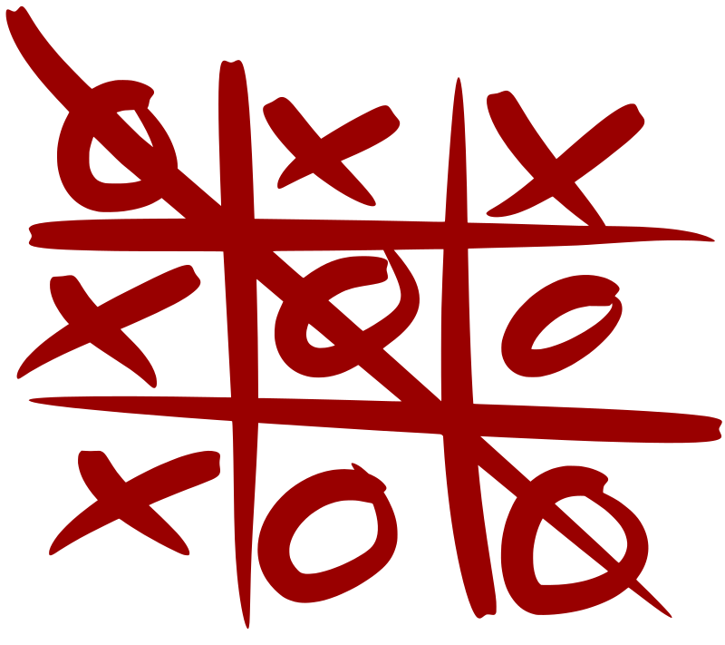

<h1><strong>

Sofia Orozco 

<h4 align="right"><strong>ISC03B

 

# 
 **UNIT 3: CAT´S GAME**

####  **The game of cat or three in a row is a game played between two players, where each player is assigned a different symbol (usually ❌ and ⭕), and spaces are marked on a board of 3\times 3×3 squares, taking alternate shifts; the game ends when one of the players places three of their symbols in line or there are no more empty spaces on the board.**
 

## ***Content*** 

<h5><strong>

> [Execution and Use](https://github.com/UP210419/UP210419_CPP/blob/main/U3/Ejec_Uso.md)
 

> [Flowchart](https://github.com/UP210419/UP210419_CPP/blob/main/U3/DF.cpp)
 

> [Development and Explanation](https://github.com/UP210419/UP210419_CPP/blob/main/U3/Des_exp.md)
 

> [Conclusions](https://github.com/UP210419/UP210419_CPP/blob/main/U3/Conc.cpp)
